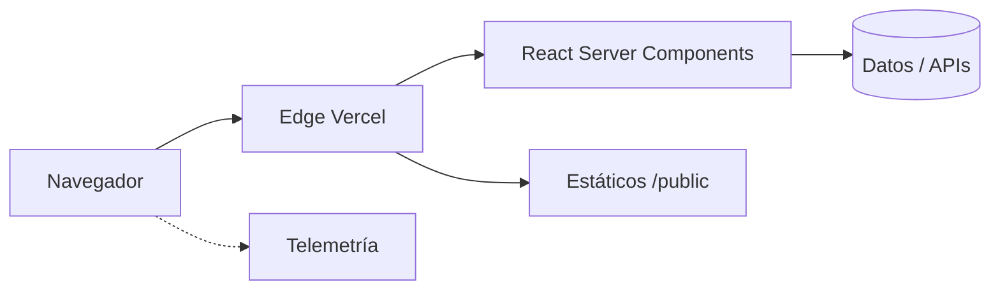

# Arquitectura de mi-website-personal

Documento de "cómo y por qué". Describe la forma del sistema, las
decisiones cardinales y los puntos de extensión. Para el "qué", revisa el
código y los ADR.

## Visión general

Aplicación Next.js 15 que sirve Sitio web personal de Alexendros.. Despliegue serverless en
Vercel con dominio alexendros.me gestionado en Hostinger.

## Componentes

### `app/` · App Router

- Estructura por ruta. `layout.tsx` envuelve el árbol y aplica fuentes Geist.
- Server Components por defecto. Solo se marca `'use client'` cuando el
  componente requiere efectos del navegador.
- `metadata` por ruta para SEO; el `layout.tsx` raíz expone el
  `metadataBase`.

### `components/`

- Componentes de presentación que consumen el design system Vergina
  Imperial v0.2.0.
- Iconografía: Lucide. Las atmósferas se controlan con `data-mode` y
  `data-accent`.

### `lib/`

- Utilidades sin dependencia de React (validación, mapeos, helpers).

### `public/`

- Estáticos. Imágenes optimizadas con `next/image`.

## Decisiones cardinales

- **Next.js App Router** por SSR/Static Generation híbrido y RSC nativo.
- **Tailwind v4 + tokens OKLCH** para una atmósfera consistente con
  Vergina Imperial.
- **Vercel** por la integración nativa con Next.js y previews por PR.
- **Hostinger** para DNS por consolidar en un único proveedor el dominio,
  los nameservers y la facturación.

Detalles individuales en `docs/adr/`.

## Puntos de extensión

- Nuevas rutas: añadir bajo `app/` siguiendo el patrón existente.
- Componentes Vergina Imperial: importar desde el design system en lugar
  de duplicar.
- Telemetría: si se activa Sentry, configurar en `instrumentation.ts`.

## Trade-offs aceptados

- **Bundle del cliente**: priorizamos RSC; si una pantalla es muy
  interactiva podemos perder algo de footprint estático.
- **Vendor lock-in moderado** con Vercel: aceptado por velocidad de
  despliegue y previews.
- **Tailwind v4** trae cambios respecto a v3; cuando el ecosistema vaya
  más adelantado revisaremos.

## Telemetría y observabilidad

- Sentry / GlitchTip para errores (si aplica al proyecto concreto).
- Vercel Speed Insights para Core Web Vitals.
- Logs estructurados en `runtime` accesibles desde el dashboard Vercel.

## Riesgos conocidos

- DNS desalineado entre Hostinger y Vercel rompería previews y producción.
- Migraciones de Tailwind major exigen revisar tokens.
- React 19 todavía marca límites en testing de async server components.
