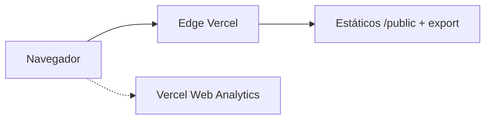

# Arquitectura de website-alexendrosme

Documento de "cómo y por qué". Describe la forma del sistema, las
decisiones cardinales y los puntos de extensión. Para el "qué", revisa el
código y los ADR.

## Visión general

Aplicación Next.js 16 que sirve el sitio web personal de Alexendros — alexendros.me,
"espacio libre de dinero". **Export estático** (`output: "export"`) desplegado en
Vercel con dominio gestionado en Hostinger. Colecciones de contenido: `/proyectos` y
`/opinion`.

```mermaid
flowchart LR
  cliente[Navegador] --> edge[Edge Vercel]
  edge --> static[Estáticos /public + export]
  cliente -.-> analytics[Vercel Web Analytics]
```

## Componentes

### `app/` · App Router

- Estructura por ruta. `layout.tsx` envuelve el árbol y aplica fuentes Geist.
- Server Components por defecto. Solo se marca `'use client'` cuando el
  componente requiere efectos del navegador.
- `metadata` por ruta para SEO; el `layout.tsx` raíz expone el
  `metadataBase`.

### `components/`

- Componentes de presentación que consumen el design system Alexendros.me Design System.
- Iconografía: Lucide. Las atmósferas se controlan con `data-mode` y
  `data-accent`. Claves: nav, footer, theme-provider/theme-toggle,
  locale-toggle, search-dialog, anti-monetization-banner, translated-labels, mdx.

### `lib/`

- Utilidades sin dependencia de React (validación, mapeos, helpers).
- `lib/content/` · loader + tipos (colecciones `proyectos` | `opinion`), MDX con
  gray-matter + Zod. `lib/i18n/` · diccionarios es/en. `lib/seo/` ·
  breadcrumb JSON-LD, hreflang, OG helpers. `lib/feed.ts` · RSS/Atom.
  `lib/og-image.tsx` · OG dinámicas (PROYECTOS_THEME / OPINION_THEME).

### `content/`

- `content/proyectos/` y `content/opinion/` con frontmatter validado
  (title, date, tags, description, draft).

### `public/`

- Estáticos: sitemaps segmentados (`sitemap-pages.xml`, `sitemap-proyectos.xml`,
  `sitemap-opinion.xml`), feeds (`feed.xml`, `feed-proyectos.*`, `feed-opinion.*`),
  `search-index.json`, `sw.js`, `manifest.json`, `og/`.

## Decisiones cardinales

- **Next.js App Router** con **export estático** (SSG), RSC nativo.
- **Tailwind v4 + tokens OKLCH** para una atmósfera consistente con
  Alexendros.me Design System.
- **Vercel** por la integración nativa con Next.js, previews por PR y redirecciones
  permanentes (308) para las rutas legacy.
- **Hostinger** para DNS por consolidar en un único proveedor el dominio,
  los nameservers y la facturación.

Detalles individuales en `docs/adr/` (0002 reconversión, 0003 theme-storage, 0004 pre-paint).

## Puntos de extensión

- Nuevas rutas: añadir bajo `app/` siguiendo el patrón existente.
- Contenido: añadir MDX en `content/ideas/` o `content/acciones/`.
- Componentes Alexendros.me Design System: importar desde el design system en lugar
  de duplicar.
- Telemetría: si se activa Sentry, configurar en `instrumentation.ts`.

## Trade-offs aceptados

- **Bundle del cliente**: priorizamos RSC; si una pantalla es muy
  interactiva podemos perder algo de footprint estático.
- **Vendor lock-in moderado** con Vercel: aceptado por velocidad de
  despliegue y previews.
- **Export estático**: no hay SSR/ISR; las redirecciones viven en `vercel.json`.
- **Tailwind v4** trae cambios respecto a v3; cuando el ecosistema vaya
  más adelantado revisaremos.

## Telemetría y observabilidad

- Vercel Web Analytics (`@vercel/analytics`) activo.
- Lighthouse CI con budgets (LCP, CLS, TBT) en `.github/workflows/lighthouse-scores.yml`.
- Tests a11y axe-core WCAG 2.1 AA + health-check.sh en CI.

## Riesgos conocidos

- DNS desalineado entre Hostinger y Vercel rompería previews y producción.
- Migraciones de Tailwind major exigen revisar tokens.
- React 19 todavía marca límites en testing de async server components.
