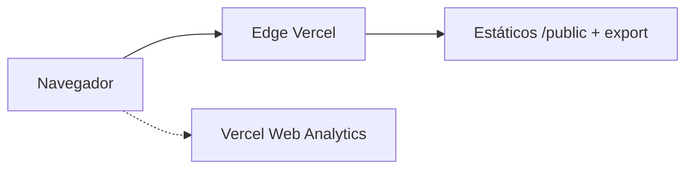

# Arquitectura de website-alexendrosme

### Propósito de este documento

- **Objetivos:** Describir capas, fronteras de módulos y no-objetivos del sitio
  estático para que un cambio no rompa el export, las colecciones ni la
  frontera con alexendros.dev.
- **Estructura:** Propósito del producto → capas → módulos → decisiones
  cardinales → calidad → no-objetivos → stack.
- **Contenido a integrar según contexto:** Adapta módulos y stack de este repo.
  No copies la arquitectura de una CLI ni un SaaS. No metas stack/devops de
  producto en este sitio. Las colecciones son `proyectos` y `opinion`.

Documento de "cómo y por qué". Describe la forma del sistema, las decisiones
cardinales y los puntos de extensión. Para el "qué", revisa el código y los
ADR.

## 1. Propósito

Aplicación Next.js 16 que sirve el sitio web personal de Alexendros —
[alexendros.me](https://alexendros.me), espacio libre de dinero. **Export
estático** (`output: "export"`) desplegado en Vercel con dominio gestionado
en Hostinger. Colecciones de contenido: `/proyectos` y `/opinion`.

Entrada: MDX en `content/` + componentes de presentación.  
Salida: HTML/CSS/JS estáticos en `out/`.

## 2. Capas


```mermaid
flowchart LR
  cliente[Navegador] --> edge[Edge Vercel]
  edge --> static[Estáticos /public + export]
  cliente -.-> analytics[Vercel Web Analytics]
```

```
Visitante
    │  HTML estático (Vercel)
    ▼
app/                App Router + metadata + i18n
components/         UI del design system `--ax-*`
lib/content/        loader MDX + Zod
content/            proyectos/ · opinion/
public/             sitemaps, feeds, og, search-index
```

## 3. Módulos

### `app/` · App Router

- Estructura por ruta. `layout.tsx` envuelve el árbol y aplica fuentes Geist.
- Server Components por defecto. Solo se marca `'use client'` cuando el
  componente requiere efectos del navegador.
- `metadata` por ruta para SEO; el `layout.tsx` raíz expone el `metadataBase`.

### `components/`

- Componentes de presentación que consumen el design system Alexendros.me.
- Iconografía: Lucide. Las atmósferas se controlan con `data-mode` y
  `data-accent`. Claves: nav, footer, theme-provider/theme-toggle,
  locale-toggle, search-dialog, anti-monetization-banner, translated-labels,
  mdx.

### `lib/`

- Utilidades sin dependencia de React (validación, mapeos, helpers).
- `lib/content/` · loader + tipos (colecciones `proyectos` | `opinion`), MDX
  con gray-matter + Zod. `lib/i18n/` · diccionarios es/en. `lib/seo/` ·
  breadcrumb JSON-LD, hreflang, OG helpers. `lib/feed.ts` · RSS/Atom.
  `lib/og-image.tsx` · OG dinámicas (PROYECTOS_THEME / OPINION_THEME).

### `content/`

- `content/proyectos/` y `content/opinion/` con frontmatter validado
  (title, date, tags, description, draft).

### `public/`

- Estáticos: sitemaps segmentados (`sitemap-pages.xml`,
  `sitemap-proyectos.xml`, `sitemap-opinion.xml`), feeds (`feed.xml`,
  `feed-proyectos.*`, `feed-opinion.*`), `search-index.json`, `sw.js`,
  `manifest.json`, `og/`.

## 4. Decisiones cardinales

- **Next.js App Router** con **export estático** (SSG), RSC nativo.
- **Tailwind v4 + tokens OKLCH** para una atmósfera consistente con
  Alexendros.me Design System.
- **Vercel** por la integración nativa con Next.js, previews por PR y
  redirecciones permanentes (308) para las rutas legacy.
- **Hostinger** para DNS por consolidar en un único proveedor el dominio,
  los nameservers y la facturación.

Detalles individuales en [`docs/architecture/decisions/`](docs/architecture/decisions/)
(0002 reconversión, 0003 theme-storage, 0004 pre-paint). El stub
[`DECISIONS.md`](DECISIONS.md) apunta aquí.

## 5. Calidad

- Vitest sobre `__tests__/**/*.test.{ts,tsx}` con umbrales 63/62/60/49
  (baseline del producto; flota ≥ 70 % documentada, no se baja el gate)
- Playwright e2e + a11y (axe-core WCAG 2.1 AA)
- Lighthouse CI con budgets (LCP, CLS, TBT)
- CI: `quality` (format, typecheck, lint, verify, audit) → `test`
  (Vitest + coverage) → `build` (export `out/`) → `smoke` (rutas canónicas).
  Jobs de producto `e2e`, `lhci`, `a11y`, `perf`, `deploy` no se renombran.

## 6. Puntos de extensión

- Nuevas rutas: añadir bajo `app/` siguiendo el patrón existente.
- Contenido: añadir MDX en `content/proyectos/` o `content/opinion/`.
- Componentes: importar desde el design system en lugar de duplicar.
- Telemetría: Vercel Web Analytics ya activo; Sentry no forma parte del sitio.

## 7. No-objetivos

- No reescribir la UI/UX editorial en PRs de plataforma
- No introducir anuncios, afiliados ni paywalls
- No mover stack/devops de producto a este repo (viven en alexendros.dev)
- No secretos en el repo ni en el HTML exportado

## 8. Trade-offs aceptados

- **Bundle del cliente**: priorizamos RSC; si una pantalla es muy
  interactiva podemos perder algo de footprint estático.
- **Vendor lock-in moderado** con Vercel: aceptado por velocidad de
  despliegue y previews.
- **Export estático**: no hay SSR/ISR; las redirecciones viven en
  `vercel.json`.
- **Tailwind v4** trae cambios respecto a v3; cuando el ecosistema vaya
  más adelantado revisaremos.

## 9. Telemetría y observabilidad

- Vercel Web Analytics (`@vercel/analytics`) activo.
- Lighthouse CI con budgets (LCP, CLS, TBT) en
  `.github/workflows/lighthouse-scores.yml`.
- Tests a11y axe-core WCAG 2.1 AA + health-check en CI.

## 10. Riesgos conocidos

- DNS desalineado entre Hostinger y Vercel rompería previews y producción.
- Migraciones de Tailwind major exigen revisar tokens.
- React 19 todavía marca límites en testing de async server components.

## 11. Stack

Next.js 16 App Router · TypeScript strict · Tailwind v4 · Node ≥ 22 · npm ·
Vitest · Playwright · Zod · gray-matter · Vercel (export estático).
